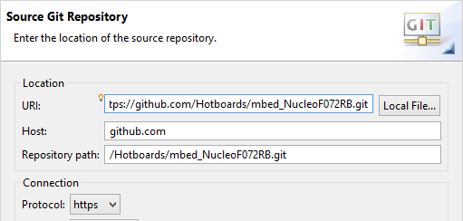

# mbed_NucleoF411RE

Now is easier than ever to use **mbed** library offline with eclipse and GNU ARM. In this repository you will find a eclipse project with mbed library for ST [**NucleoF411RE**](http://developer.mbed.org/platforms/ST-Nucleo-F411RE/) board.

**Updated to** mbed tag 93

##Prerequisits

You need to have installed [**GNU ARM** compiler](https://launchpad.net/gcc-arm-embedded) and [**Eclipse C/C++** IDE](http://www.eclipse.org/downloads/packages/eclipse-ide-cc-developers/lunasr1a) within [**GNU ARM Eclipse Plugin**](http://gnuarmeclipse.livius.net/blog/), check the following links in order to make the setup

- [Installing the GNU ARM compiler ](http://hotboards.org/index.php/es/blog/20-spanish/blog/st/81-pt1-instalando-compilador-windows)
- [Installing windows driver and update firmware ](http://hotboards.org/index.php/es/blog/20-spanish/blog/st/82-pt2-instalando-openocd-windows)
- [Installing Eclipse with GNU ARM Plugin](http://hotboards.org/index.php/es/blog/20-spanish/blog/st/84-toolchain-pt3-proyectos-con-eclipse)

##Importing project to workspace

This method is easy, just clone or download ( _don't forget to unzip it_ ) the repository into your eclipse workspace ( _the folder where you have all your eclipse projects_ ), then open eclipse and goto to menu **File -> Import...** in the new window select **General -> Existing Projects into Worspace** and then **Next**.

In the next part select the option **Select root directory:** and **Browse...** the project folder which i assume is in your workspace by right now, just click on **Finish**, open the file **main.cpp** and start coding in mbed style. Have fun!!.

By the way you could use your new imported project as a template and every time you want to make a new project just copy and paste it ( [_check the this post, right in the middle_](http://hotboards.org/index.php/es/blog/20-spanish/blog/st/86-toolchain-pt2-rrogramando-con-openocd) ).

If you need more information about importing projects in eclipse just check the following [**post** ](http://hotboards.org/index.php/es/blog/20-spanish/blog/st/117-importando-proyectos-en-eclipse)

##Cloning the project using Egit

First of all you need to install the plugin **Egit** in your Eclipse IDE, then goto menu **File -> Import...** in the new window select **Git -> Projects from git** and then **Next**.

Select **Clone URI** and Next, here you only need to write the github address of this repository in the URI: text box ( _check the image below_ )

**https://github.com/Hotboards/mbed_NucleoF411RE.git**

Click on Next, wait and then Next, in this window you have to **Browse** your eclipse workspace, then next, again next and finally finish.

Now you have a new project in Eclipse, open the file **main.cpp** and start coding in mbed style!!. By the way if you do not want to keep versioning your new project just right click and the **Team -> Disconnect**.

##Programing your board

Is the same as you do with mbed online, every time you compile your project, in folder **Debug** you will find a **.bin** file, just copy and paste it in your Nucleo Drive.

But there is an advantage in eclipse, if you install OpenOCD you could program the board without living the IDE.

- [Programing with bootloader](http://hotboards.org/index.php/es/blog/20-spanish/blog/st/102-programando-con-el-bootloader)
- [Programing with OpenOCD from Eclipse](http://hotboards.org/index.php/es/blog/20-spanish/blog/st/86-toolchain-pt2-rrogramando-con-openocd)
- [Debugging with OpenOCD and Eclipse](http://hotboards.org/index.php/es/blog/20-spanish/blog/st/89-toolchain-pt6-debuggeando-con-openocd)

And.. one more thing, if you want to know the process to compile the embed library from scratch check [**here**](http://hotboards.org/index.php/es/blog/20-spanish/blog/st/114-mbed-en-eclipse)
